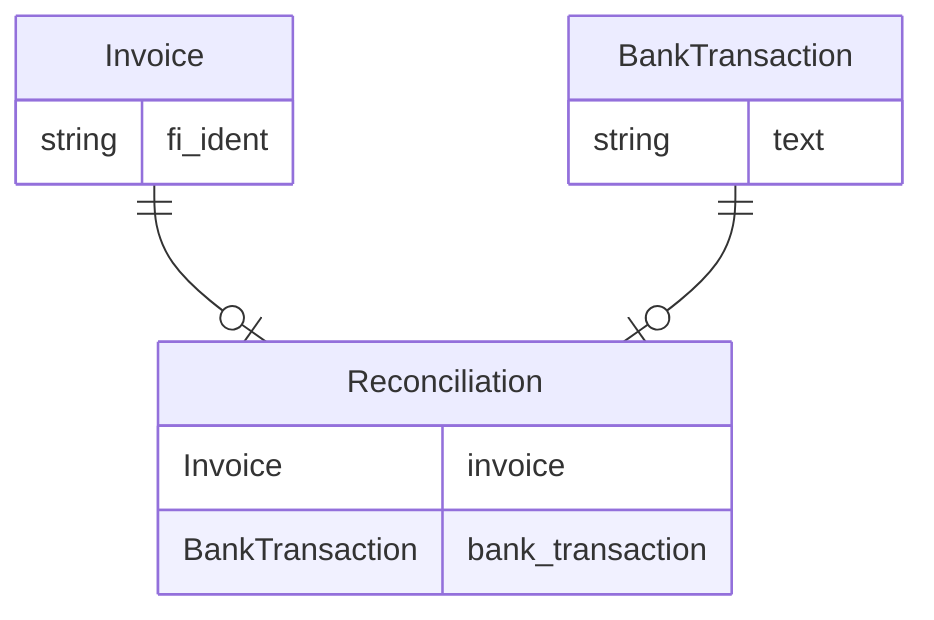

# Django ORM Pitfall

Django ORM is one of Django's best features. It is super convenient, but it can be tempting to forget the queries that are executed behind the Python fairyland.

## Issue { .fs-3 }

We observed a spike in CPU usage on the database side whenever a task was executed.

## Context { .fs-3 }

This task is responsible for reconciliation, among other things.

Reconciliation is the process of matching bank transactions to outgoing or incoming invoices. In this article we will only focus on outgoing invoices, and more precisely on [FIK payments](https://www.atlar.com/blog/guide-to-danish-bank-payments#:~:text=FIK%20payments,-also).

Reconciling outgoing invoices is crucial because it allows to tell apart payers that successfully paid from those that still owe money.

A simplified version of the models is as follows:



To put it into other words, reconciliation is going through unreconciled bank transactions to find the matching invoice.

## Troubleshooting { .fs-3 }

Here is what the code looks like

```python
unreconciled_fi_bank_transactions = BankTransaction.objects.filter(...)

for bank_transaction in unreconciled_fi_bank_transactions:
    matched_invoice = Invoice.objects.filter(
        fi_ident=bank_transaction.text
    ).first()

    if matched_invoice is not None:
        # ...
```

The issue is that in each iteration of the for loop, we are querying the database.

It's better to make a single request to fetch all relevant objects from the database and then work on them with Python.

```python
unreconciled_fi_bank_transactions = BankTransaction.objects.filter(...)
bank_transaction_fi_idents = [b.text for b in unreconciled_fi_bank_transactions]

matched_invoices = Invoice.objects.filter(
    fi_ident__in=bank_transaction_fi_idents
)

for bank_transaction in unreconciled_fi_bank_transactions:
    for invoice in matched_invoices:
        if bank_transaction.text == invoice_asset.fi_ident:
            # ...
```

## Conclusion { .fs-3 }

One shouldn't try to blindly optimize a new feature, after premature optimization is the root of all evil. Such scenarios need to be spotted by monitoring the database.

Also remember that it's not about making the fewest amount of requests, think in terms of [big O](https://en.wikipedia.org/wiki/Big_O_notation) as it's about scalability.