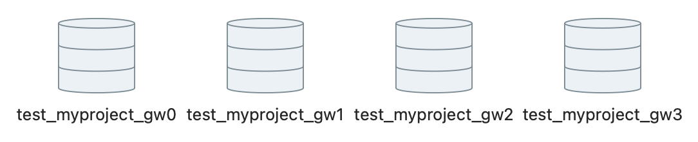

# Flaky tests

Lately in my team, we had issues running our test suite as some of the tests would randomly fail. This would force us to re-run the whole CI build, expecting for a better outcome next time — a quite frustrating experience.

For references, we are using `pytest`, `pytest-xdist` and `pytest-django` amongst others and we're running the tests in parallel with 4 workers, i.e. `pytest -n 4`.

## Database

We first thought flakiness originated from the database.

After inspection (and reading the documentation 🙂), we observed that each worker has its own database.



What if flakiness was introduced by the execution order of tests ? 

That can't be, as each test is wrapped inside a transaction.

```python
@pytest.mark.django_db
def test_something():
    # everything in this block is run inside a database transaction,
    # so all the objects created/updated will be deleted/rolled back
```

As such, everything that is happening in the database is invisible outside the transaction, i.e. you won't see any entry in the worker database.

It is also the case for fixture, no matter the scope.

```python
@pytest.fixture(scope="module")
def my_fixture():
    # this is created inside a transaction and will be deleted at 
    # the end of the scope
```

### Precision around database creation

You can run tests with `--reuse-db` or `--create-db` flag.

For optimal reason, you often want to go with `--reuse-db` to not create the database and all the tables each time you run the test suite. You only need to be aware that if you update the database schema, you'll need to run the tests with `--create-db` next time for your changes to be reflected in your test database. 

## Cache

One of the issue that we identified was that the cache was shared amongst workers, and concurrent access to it by different workers could lead to tests randomly failing.

So we changed our test configuration cache to use [DummyCache](https://docs.djangoproject.com/en/4.2/topics/cache/#dummy-caching-for-development) as backend.

```python
# settings.py
CACHES = {
    "default": {
        "BACKEND": "django.core.cache.backends.dummy.DummyCache",
    }
}
```

## Elements ordering

When querying the database, no order is guaranteed by default:

```python
@pytest.mark.django_db
def test_something():
    object1 = MyModel.objects.create(...)
    object2 = MyModel.objects.create(...)
    object3 = MyModel.objects.create(...)

    qs = MyModel.objects.all()

    assert list(res) = [object1, object2, object3]
```

In this test, the order of the elements in the list is not guaranteed. If order doesn't matter, then a set/multiset can be used instead.

```python
@pytest.mark.django_db
def test_something():
    object1 = MyModel.objects.create(...)
    object2 = MyModel.objects.create(...)
    object3 = MyModel.objects.create(...)

    qs = MyModel.objects.all()

    assert set(res) = {object1, object2, object3}
```

If ordering does matter, then it must be achieved through an `order_by()`.

```python
@pytest.mark.django_db
def test_something():
    object1 = MyModel.objects.create(...)
    object2 = MyModel.objects.create(...)
    object3 = MyModel.objects.create(...)

    qs = MyModel.objects.all().order_by(...)

    assert list(res) = [object1, object2, object3]
```

A similar issue is getting an element based on an index:

```python
EmailTemplate.objects.first()
```

As no order is guaranteed by the database, the item returned by the query may change from one test run to another.

# Conclusion

Flaky tests hinder developers workflow and lead to losing trust in your CI. As such, I believe they should be avoided at all cost. 

In general, one should be aware of the following:

- when running in parallel, workers shouldn't share any common resource (e.g. cache).
- database retrieval doesn't guarantee any order, unless explicitely stated.