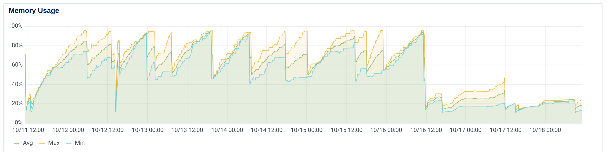

# The query itself

Query to update every objects we have in a table (~2 millions).

```python
for offer in Offer.objects.order_by("-created_at"):
    offer.offer_limits_meta["applied_payer_credit_limit"] = Money(
        offer.offer_limits_meta["applied_payer_credit_limit"], settings.BASE_CURRENCY
    )
    offer.save()
```

## OOM error

Use of servor side cursor.


No need for `iterator()` as Django does it by default when iterating over a queryset — but can be used to have control over the batch size.

## Query is taking too long

- Only load relevent fields.
- Prefer bulk operations `QuerySet.bulk_create()` and `QuerySet.bulk_update()`.
- Only update if needed.

```python
chunk_size = 2000
offers_chunk = []

for i, offer in enumerate(
    Offer.objects.order_by("-created_at")
            .only("offer_limits_meta")
            .iterator(chunk_size=chunk_size)
):
    dirty=False

    if (
        offer.offer_limits_meta 
        and not isinstanceof(
            offer.offer_limits_meta.get("applied_payer_credit_limit"), 
            Money
        )
    ):
        offer.offer_limits_meta["applied_payer_credit_limit"] = Money(
            offer.offer_limits_meta["applied_payer_credit_limit"], 
            settings.BASE_CURRENCY
        )
        dirty = True

    if dirty:
        offers_chunk.append(offer)

    if i % chunk_size == 0 and offers_chunk:
        Offer.objects.bulk_update(
            offers_chunk, 
            "offer_limits_meta", 
            batch_size=1000
        )
        offers_chunk = []
```

## Side notes

Make the migration idempotent and add some logging.

## Other database parameters

`CONN_MAX_AGE` and `ATOMIC_REQUEST`.




The memory performance of the kubernetes cluster after switching to server-side cursor. Can you spot when it was switched on? 😉